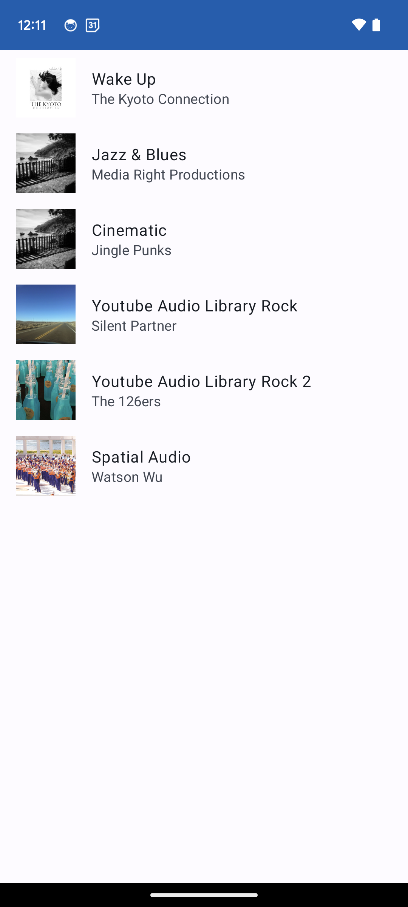
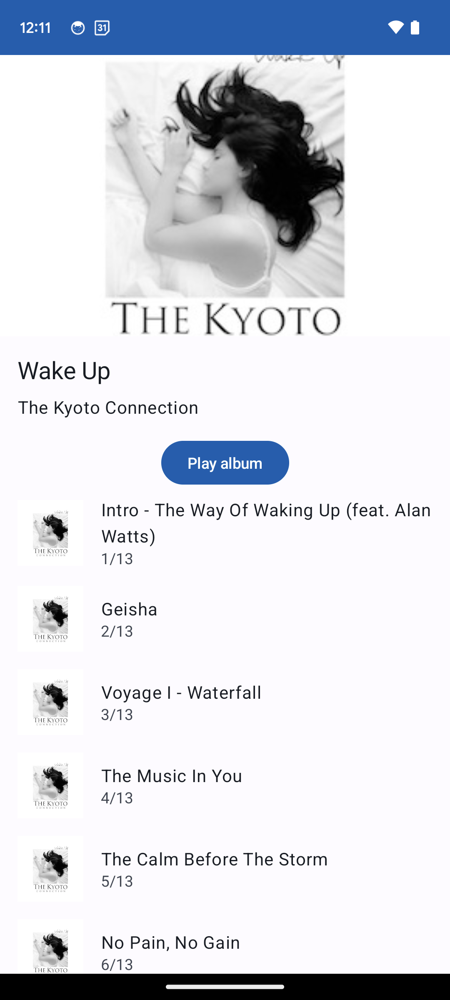
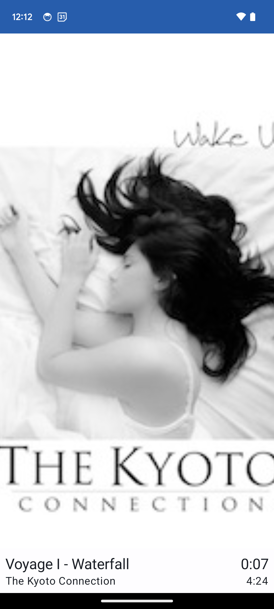

# Majelan Android Technical Test

## Getting Started

Fork this repository to work on it as you would usually do. Once you're done, send us the URL so we can take a look!

### Running the thing

This project is a fresh empty project to let you express as you want your coding style for an app going to production, so use it in Android Studio as usual

## What you'll have to do

You'll have to build a player app, and have to dev for one or two hours, or more if you want to build something more substantial, and your work will be a base for a discussion later after we have reviewed your code. 
Of course in this limited time, you won't be able to do it fully from catalog to functional player, but do your best.


Objective is to create three screens that chains like that :
- a screen containing a list of all artists
- a screen containing media of the artist selected on previous screen
- a screen player for media selected and playlist of other media of this artist

The api to retrieve the music catalog is simplify call to this [common repo](https://storage.googleapis.com/uamp/catalog.json) which contains a list of media.


#### Medias
A media is described as follow
```
{  
	"id": "spatial_04",  
	"title": "Steamtrain interior",  
	"album": "Spatial Audio",  
	"artist": "Stephan Schutze",  
	"genre": "Ambience",  
	"source": "https://storage.googleapis.com/uamp/Spatial Audio/Steamtrain.wav",  
	"image": "https://storage.googleapis.com/uamp/Spatial Audio/Steamtrain.jpg",  
	"trackNumber": 4,  
	"totalTrackCount": 6,  
	"duration": 296,  
	"site": "https://library.soundfield.com/track/65"  
}
```

### Requirements
- You must use the empty project code as a base for your work. You can add any other dependency you need.
- You have to write code in kotlin of courser, and also all the android modern stack (flow, compose, navigation, modularization, catalog,...)

### Bonus points
- You can add any extra feature that you'd like to see in this app. Be creative!


### Sample screen render
 |  | 
