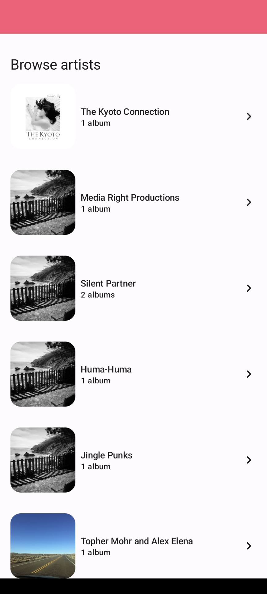
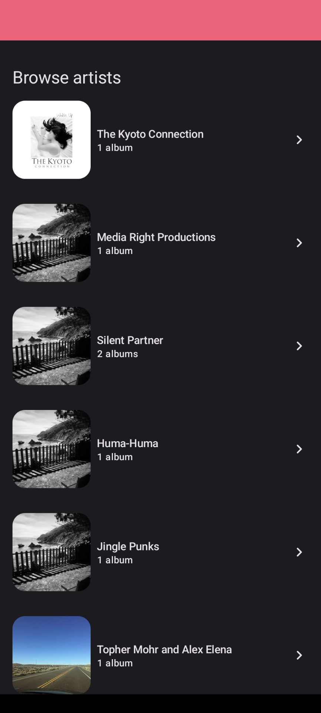
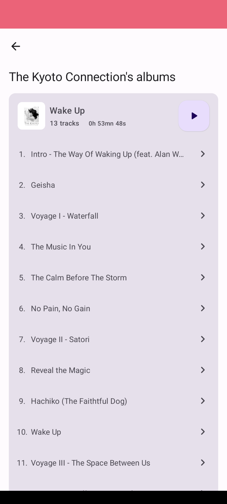
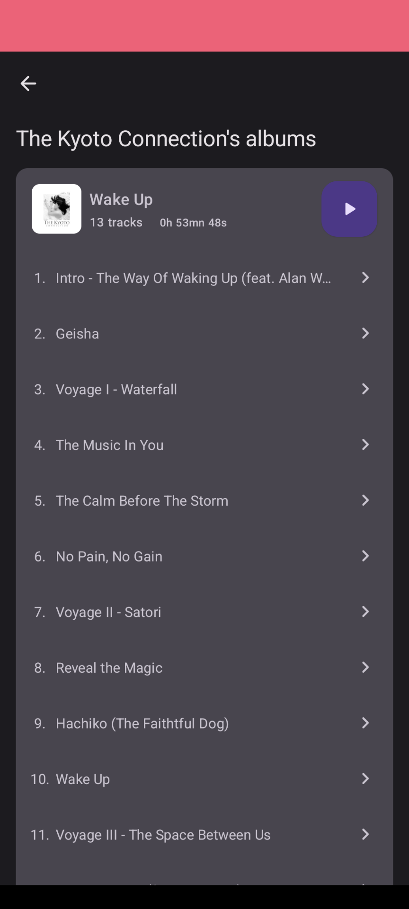
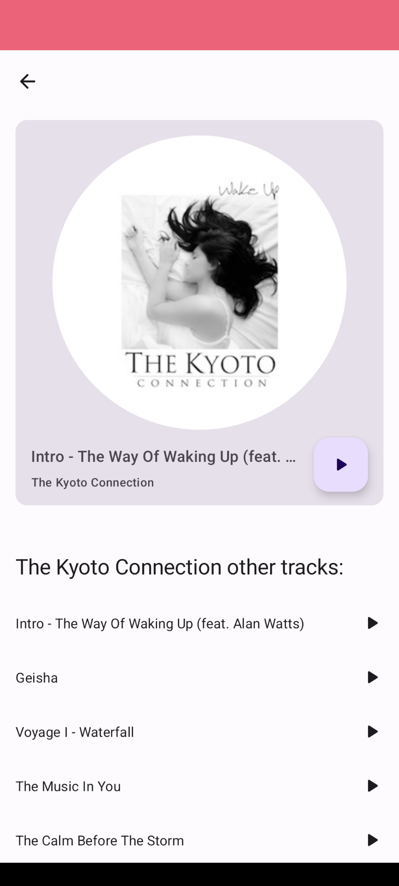
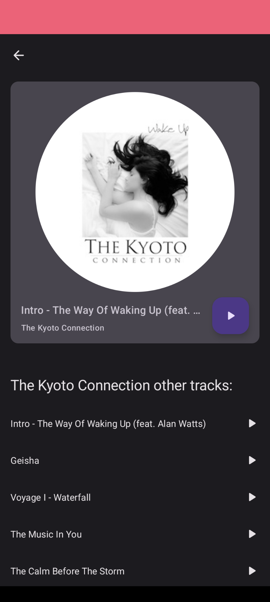

# Majelan Media Player App

Welcome to the Majelan Media Player App project! 
This Android application is designed to serve as a media player for exploring and enjoying a curated collection of audio content. 
The app is built with modern Android technologies, providing an engaging user experience.

## Features

- **Artist List:** Browse a list of all artists from the media catalog.
  - Displays the first album cover of the artist.
  - Displays the artist's name.
  - Displays the artist's album count.
  - Clicking on an item navigate to the Artist Details screen.
  - Empty state is handled
  - Error state is handled with a retry button

- **Artist Details:** Explore all the artist's medias sort by albums.
  - Displays the artist's albums
  - For each albums it displays
    - cover
    - title
    - number of tracks
    - formatted duration
    - ordered list of tracks
  - You can click play album button : it navigates to the Player Screen playing the first track of the album.
  - You can click on a track : it navigates to the Player Screen playing the track.
  - Empty state is handled
  - Error state is handled with a retry button

- **Player Screen:** Play the selected media, and view a playlist of other media by the same artist and recommendations.
  - Display current track informations (cover, title and artist)
  - Hit the play button to drop the beat 💃
  - The list of the other songs of the artist
  - The list of the other songs of the same genre (recommendations section)
  - Click a song of the list selected it in the player
  - Empty state is handled
  - Error state is handled with a retry button

- **Local Caching:** A single API call is made at the application start, then catalog is stored in a datasource for runtime.

- **Dark theme support**: The app supports dark theme depending on phone display settings.

- **R8 support**: The app supports code obfuscation with R8.

## Dependencies

The following dependencies were used in the project:

- [Retrofit](https://square.github.io/retrofit/): For making network requests and handling API integration.

- [Glide](https://bumptech.github.io/glide/): For efficient image loading and caching.

- [ViewModel](https://developer.android.com/topic/libraries/architecture/viewmodel): For managing UI-related data.

- [Flow](https://developer.android.com/kotlin/flow): For observing data changes and updating the UI.

- [Compose](https://developer.android.com/jetpack/compose): For building a nice and customizable reactive UI.

- [Media3](https://developer.android.com/guide/topics/media/media3): For playing the songs.

- [Hilt](https://developer.android.com/training/dependency-injection/hilt-android): For dependency injection and ensure best practices for testability.

- [Compose Navigation](https://developer.android.com/jetpack/compose/navigation): For navigating between composables.

- [JUnit4](https://junit.org/junit4/): For Unit testing

- [Mockk](https://mockk.io/): A mocking library for Kotlin

- [Version Catalog](https://developer.android.com/build/migrate-to-catalogs): For adding and maintaining dependencies and plugins in a scalable way.

## Architecture

- MVVM: The app is build with Model-View-ViewModel architecture. This architecture ensure a nice separation of concerns and handle some configuration changes issues.
- Clean architecture: This architecture ensure a good separation of concerns and let the application scale nicely plus it enforce good practices for testability. 3 layers:
  - data : layer that get raw data. Contains datasources, api, db, repositories, mappers and entities
  - domain : business logic layer. Contains usecases, mappers and domain entities
  - presentation : ui logic and ui.
- MVI: this architecture provides a nice way to communicate between composables and viewmodels:
  - state : A data class that holds the state of the view.
  - event : A sealed interface that list the event the ui can fire.
  - action : one shoot action to display to the user.

## Screens

### Artist List

|              Artist List light               |              Artist List dark              |
|:--------------------------------------------:|:------------------------------------------:|
|  |  |

### Artist Details

|                Artist Details light                |               Artist Details dark                |
|:--------------------------------------------------:|:------------------------------------------------:|
|  |  |

### Player

|                   Player light                   |                  Player dark                   |
|:------------------------------------------------:|:----------------------------------------------:|
|  |  |
